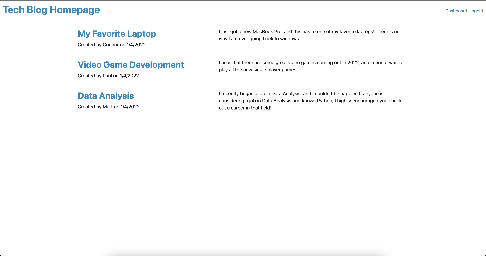
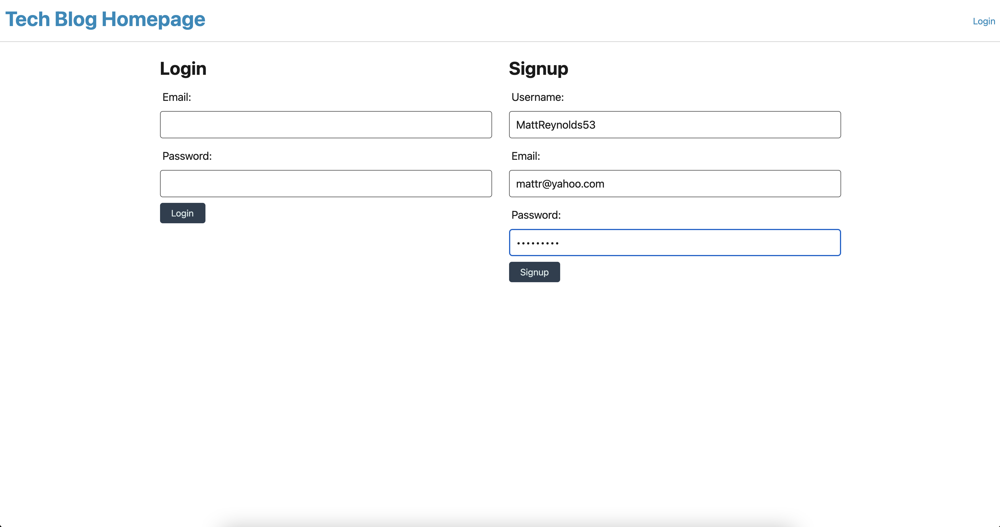
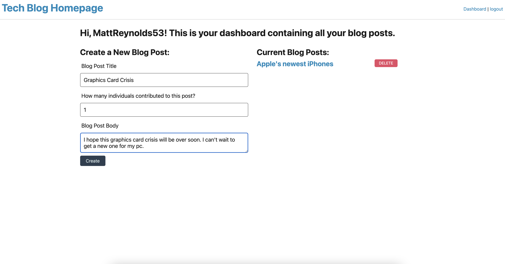
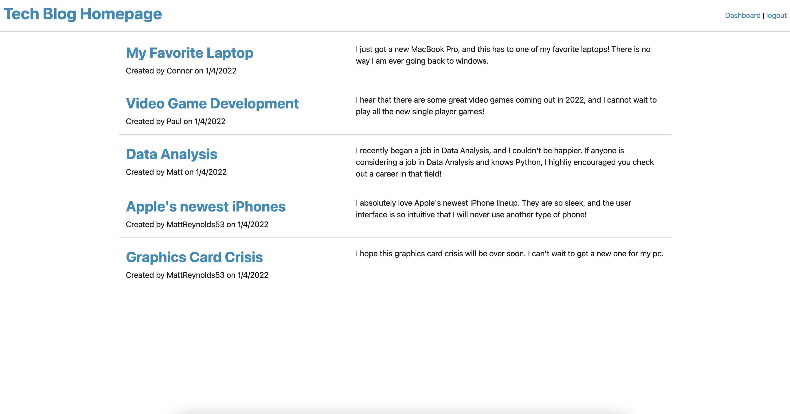
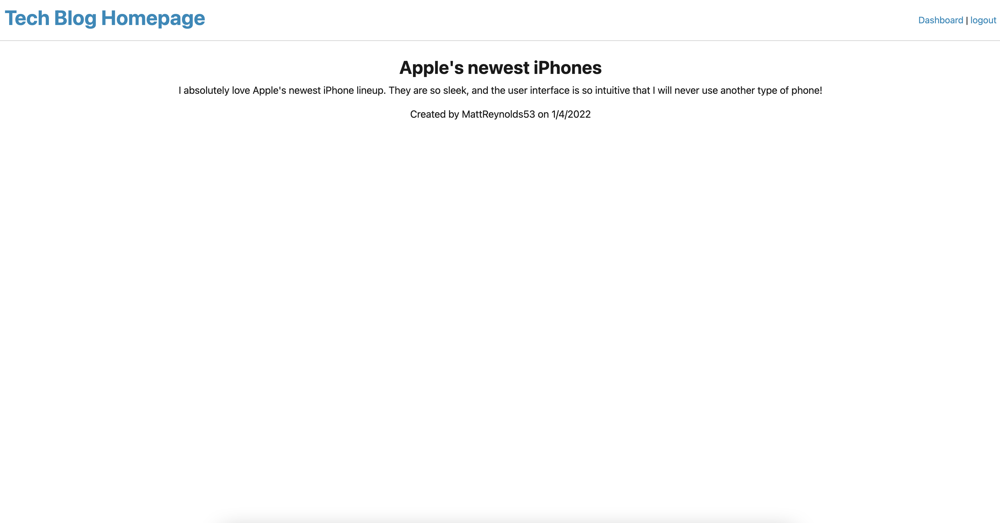

# Tech Blog Application

## Description
For this blogPost, I created a Tech Blog application that allows a user to view and create blog posts. When the user opens the application, he or she will be taken to the homepage where all previous blog posts will be displayed. When the user tries to access the blog posts, he or she will be taken to the login/signup page where he or she can either create a new account or sign in with existing credentials. When the user signs in, he or she will be able to view a personal Dashboard that has all of his or her previous blog posts along with the option to create a new one. When the user goes back to the homepage, the new blog posts will be displayed along with the preexisting ones.

## Usage
To use this application, the user will need to right-click on the server.js file in the root, and enter the command 'npm i' to install all the encessary dependencies. Then, the user can enter the command 'node server.js' to start a server. Then the user can go to the website 'http://localhost:3001' to view the deployed application and begin viewing and creating blog posts.

## Important Links

GitHub Repository: https://github.com/MattReynolds53/My-Tech-Blog

Deployed Application Link: https://boiling-stream-98053.herokuapp.com/

## Screenshots

